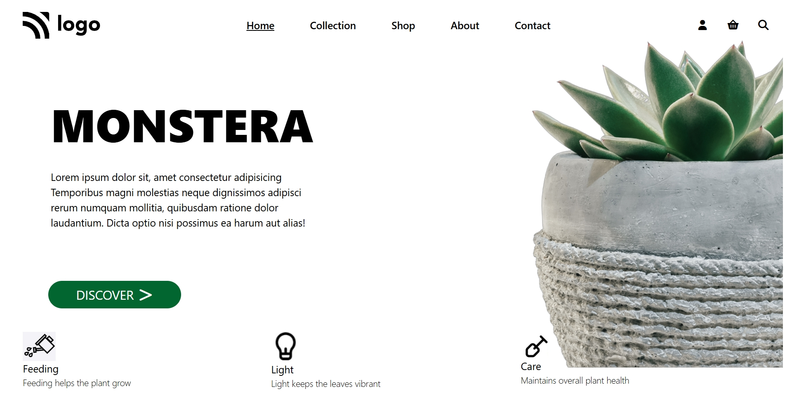

# 🌿 MONSTERA - Plant Store Landing Page

[live@](https://monstera-landing-page-wheat.vercel.app/)

A sleek and minimal **plant store landing page** built using **HTML**, **Tailwind CSS**, and **Font Awesome**.  
This responsive page highlights elegant typography, subtle hover effects, and clean layout design to create a modern e-commerce interface.

---

## 🚀 Features

- 🌱 **Modern UI Design** — Clean layout with a focus on readability and simplicity.  
- 💡 **Tailwind CSS** — Fast, utility-first styling for responsive design.  
- 🛒 **Navigation Bar** — Includes links for Home, Collection, Shop, About, and Contact.  
- 🔍 **Icons Integration** — Uses Font Awesome icons for user, cart, and search.  
- 🌼 **Hero Section** — Large heading, descriptive text, and a “Discover” call-to-action button.  
- 🌻 **Info Cards** — Highlights key plant care aspects (Feeding, Light, Care) with icons.  
- 🌿 **Image Layout** — Decorative background image positioned absolutely for style.  

---

## 🧰 Technologies Used

- **HTML5**  
- **Tailwind CSS (via CDN)**  
- **Font Awesome (Icons)**
---
## project screenshot
